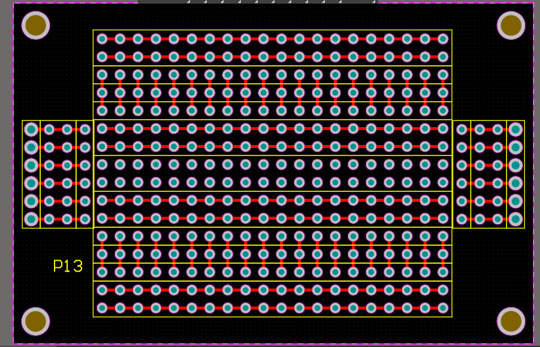
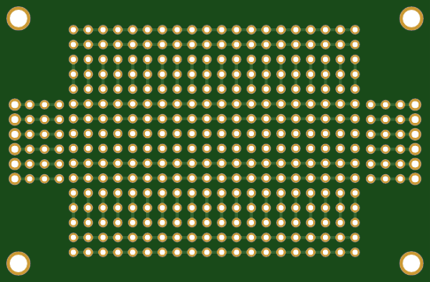

# pcb-esp-protoboard
PCB Designed as protoboard for ESP8266 and ESP32 projects.

Mainly focuses on providing accurate spacing to put Your ESP into and have full 3 rows of lines to connect for servos or other sensors.

